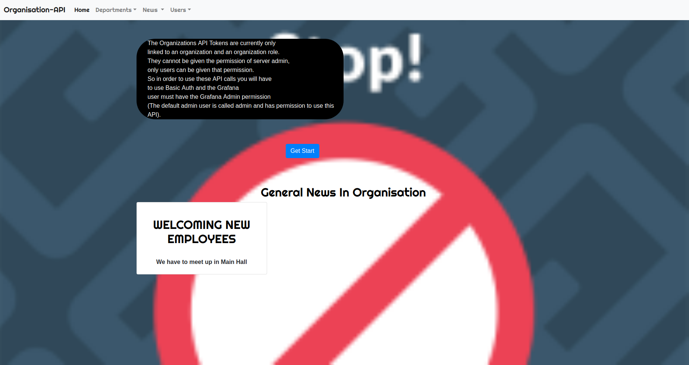

# API-OF-ORGANISATION

## Author 

`NIYONKURU Honorine`

## OVER VIEW OF THIS PROJECT
Project screenshoots

## Contents are the following
  - [x] App description
  - [x]  Technologies used
  - [x]  Installation
  - [x] User Story
  - [x]  Contacts
  - [x]  License

### APPLICATION DESCRIPTION

This application will allow Users to add different Departments,  we found in huge organisation and News in that Organisation.
This project is mainly concerned about using API.

 ### TECHNOLOGIES USED
 

 + IntelliJ IDEA Community Edition`Java`
 + Spark Java Web Framework
 + Handlebars Template Engine
 +  #### PostgreSQL for Database
    
  ### INSTALLATION
 
 1. Install  `IntelliJ IDEAL Community Edition`
 2. Clone this repository(https://github.com/niygomhonor/API-OF-ORGANISATION)
 3. Open it within IntelliJ
 
 
 ####  Visit this link to add Department,Users,
 
 - [x] [Organisation-API-Project](https://organisation-api-neodo.herokuapp.com/)
 
 ###  User story(BDD)

   
  ### CONTACTS
  
  
- [X]  For support contact us:

     +  Email:niygomhonor@gmail.com
     +  Instagram:neodohonorine2001
     +  Phone.Nbr:+2507309838
     +  LinkedIn:NIYONKURU Honorine
     +  Facebook:NIYONKURU Neodo Honorine
     +  Slack:NIYONKURU Honorine

     
### LISENCE
- [x] MIT

Copyright &copy; [2019] NIYONKURU Honorine

Permission is hereby granted, free of charge, to any person obtaining a copy of this software and associated documentation files (the "Software"),
 to deal in the Software without restriction,including without limitation the rights to use, 
 copy, modify, merge, publish, distribute, sublicense, and/or sell copies of the Software, and to permit persons to whom the Software is furnished to do so,
  subject to the following conditions:

The above copyright notice and this permission notice shall be included in all copies or substantial portions of the Software.

THE SOFTWARE IS PROVIDED "AS IS", WITHOUT WARRANTY OF ANY KIND, EXPRESS OR IMPLIED, INCLUDING BUT NOT LIMITED TO THE WARRANTIES OF MERCHANTABILITY, 
FITNESS FOR A PARTICULAR PURPOSE AND NONINFRINGEMENT. IN NO EVENT SHALL THE AUTHORS OR COPYRIGHT HOLDERS BE LIABLE FOR ANY CLAIM, DAMAGES OR OTHER LIABILITY,
 WHETHER IN AN ACTION OF CONTRACT, TORT OR OTHERWISE, ARISING FROM, OUT OF OR IN CONNECTION WITH THE SOFTWARE OR THE USE OR OTHER DEALINGS IN THE SOFTWARE.
